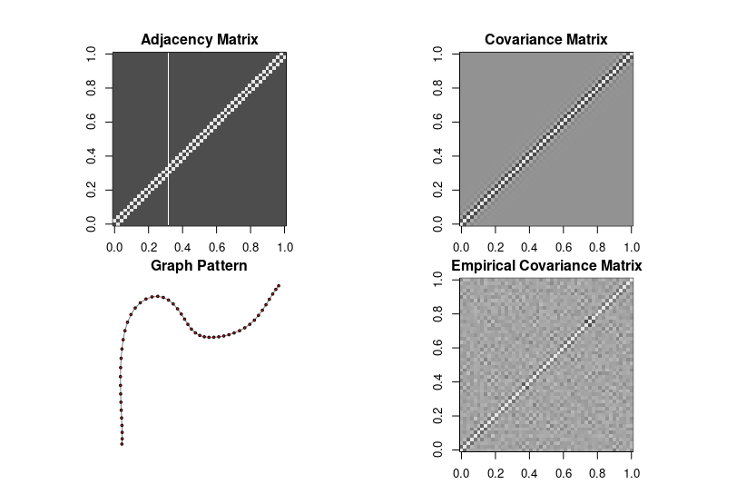

# Learning-Linear-SEM-as-distributions

## Directed graph
## Undircted graph



## Data Folder:
Real Bayesian network from bnlearn;

## main.py (To be seperated into data.py, eval.py, algo.py, and main.py)

```diff
+ (Done) General synthetic SEM data;
+ (Done) (FIXED) <**R language**>: bnlearn R data
+ (Done) Tree structure synthetic data;
 
+ (Done) DAG: Liear regression algorithm;
+ (Done) DAG: Least square algorithm;
+ (Done) Undirected graph: GLASSO algotirhm;
+ (Done) Undirected graph: empirical estimator;
 
+ (Done) Performance evaluation (KL-distance) on DAG;
+ (Done) Performance evaluation (KL-distance) on Undirected graph;

+ (Done) Overleaf: algorithm 1;
+ (Done) Overleaf: algorithm 2;
+ (Done) Overleaf: algorithm 3;
+ (Done) Overleaf: algorithm 4;
+ (Done) Add R CLIME & TIGER algorithm;
+ (Done) Code for generate plot;

- (TODO) Data: synthetic ill-conditioned data;
- (TODO) Experiments: how how the error decreases for empirical and GLASSO on separate plots;
- (TODO) Experiments: For distributions generated by degree 10 Bayes network, run our three algorithms with d=5. See how fast the errors converge.;
- (TODO) Experiments: Ill-conditioned models. Like say one of the variables has noise variance very close to 0.
```


## config.py (updated)
Set parameters for Bayesian network (eg. node number, graph degree, sample size)

## utils.R
Load bnlearn graph;
CLIME algorithm;
TIGER algorithm.
