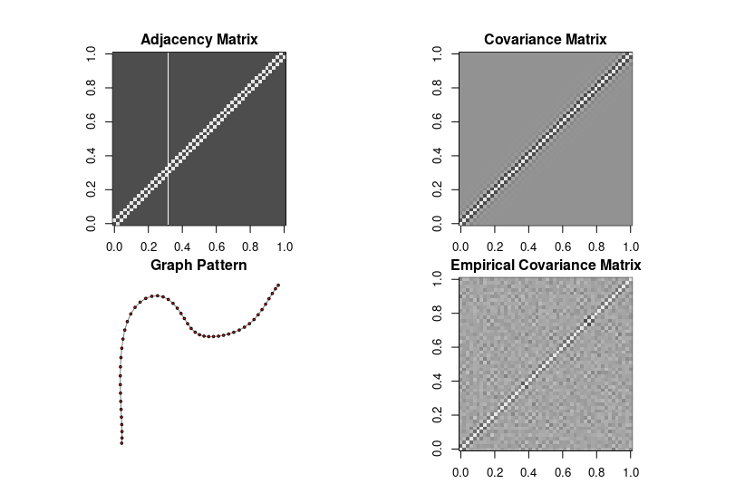

# Learning-Linear-SEM-as-distributions

## Directed graph
## Undircted graph



## Data Folder:
Real Bayesian network from bnlearn;

## data.py

### Graph
```diff
+ Tree structure graph
+ ER random graph
```

### Data
```diff
+ Synthetic linear SEM data
+ Real Bnlearn data
```
## main.py (eval.py, algo.py, and main.py)

```diff
+ (Done) General synthetic SEM data;
+ (Done) (FIXED) <**R language**>: bnlearn R data
+ (Done) Tree structure synthetic data;
 
+ (Done) DAG: Liear regression algorithm;
+ (Done) DAG: Least square algorithm;
+ (Done) Undirected graph: GLASSO algotirhm;
+ (Done) Undirected graph: empirical estimator;
 
+ (Done) Performance evaluation (KL-distance) on DAG;
+ (Done) Performance evaluation (KL-distance) on Undirected graph;

+ (Done) Overleaf: algorithm 1;
+ (Done) Overleaf: algorithm 2;
+ (Done) Overleaf: algorithm 3;
+ (Done) Overleaf: algorithm 4;
+ (Done) Add R CLIME & TIGER algorithm;
+ (Done) Code for generate plot;
+ (Done) Data: synthetic ill-conditioned data;
+ (Done) Experiments: Ill-conditioned models. Like say one of the variables has noise variance very close to 0;
+ (Done) Experiments: how the error decreases for empirical and GLASSO on separate plots;


- (TODO) For distributions generated by degree 10 Bayes network, run our three algorithms with d=5. See how fast the errors converge.
- (TODO) Real datasets from bnlearn
- (TODO) Ill-conditioned models. Like say one of the variables has noise variance very close to 0. Hopefully, here we can also find some difference between CauchyEst and CauchyEstGeneral;
- (TODO) some fraction have  N = r.normal(scale = 10^-10) others have N = r.normal(scale = 1.0) as before;
- (TODO) for each server job, try running on "1 algorithm, 1 parameter setting, X samples". that way you can parallelize quite a lot and you can plot each graph line (with error bars) as soon as one of these jobs complete.
```


## config.py (updated)
Set parameters for Bayesian network (eg. node number, graph degree, sample size)

## utils.R
```diff
+ Load bnlearn graph;
+ CLIME algorithm;
+ TIGER algorithm.
```
