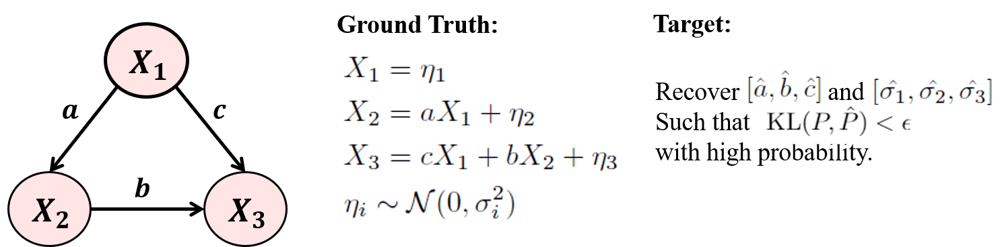

 &nbsp; &nbsp;

   
[](http://ansicolortags.readthedocs.io/?badge=latest)
[](https://GitHub.com/Naereen/StrapDown.js/graphs/commit-activity)
[](https://opensource.org/licenses/Apache-2.0)                                                      

# Learning Sparse Fixed-Structure Gaussian Bayesian Networks


## Introduction
                          
Gaussian Bayesian networks (a.k.a.\ linear Gaussian structural equation models) are widely used to model causal interactions among continuous variables.
In this work, we study the problem of **learning a fixed-structure Gaussian Bayesian network up to a bounded error in total variation distance.**
We analyze the commonly used node-wise least squares regression **LeastSquares** and prove that it has the near-optimal sample complexity.
We also study a couple of new algorithms for the problem:
- **BatchAvgLeastSquares** takes the average of several batches of least squares solutions at each node, so that one can interpolate between the batch size and the number of batches. We show that **BatchAvgLeastSquares** also has near-optimal sample complexity. 
- **CauchyEst** takes the median of solutions to several batches of linear systems at each node. We show that the algorithm specialized to polytrees, **CauchyEstTree**, has near-optimal sample complexity.
Experimentally, we show that for uncontaminated, realizable data, the **LeastSquares** algorithm performs best, but in the presence of contamination or DAG misspecification, **CauchyEst, CauchyEstTree** and **BatchAvgLeastSquares** respectively perform better.

## Example
 


## Prerequisites

- **Python 3.6+**
   - `networkx`
   - `argpase`
   - `itertools`
   - `numpy`
   - `scipy`
   - `sklearn`
   - `matplotlib`
   - `torch`: Optional.
- **R 4.0.0**
   - `rpy2`: Python interface, enables calling R from Python. Install [rpy2](https://pypi.org/project/rpy2/) first.
   - `bnlearn` : [Bayesian network learning and inference](bnlearn.com) 
   - `glasso` : [Graphical Lasso: Estimation of Gaussian Graphical Models](https://cran.r-project.org/web/packages/glasso/index.html)
   - `flare`: [Family of Lasso Regression](https://cran.r-project.org/web/packages/flare/index.html)

## Contents

- **Data**  - Real Bayesian network data from bnlearn;
- `data.py` - synthetic DAG data, including graph simulation and data simulation. Load real Bnlearn data 
- `evl.py` - algorithm accuracy evaluation based on KL-divergence; 
- `config.py` - Set parameters for Bayesian network (eg. node number, graph degree, sample size)
- `methods.py` - the implementation of all algorithms
- `utils.R` - load bnlearn graph; Run CLIME algorithm
- `main.py` - Run some examples of our algorithm

## Parameters

| Parameter    | Type | Description                      | Options            |
| -------------|------| ---------------------------------| -------------      |
| `n`          |  int |  number of nodes                 |      -             |
| `s`          |  int |  number of samples               |      -             |
| `d`          |  int |  average degree of node          |  -            |
| `ill`        |  int |  number of ill conditioned nodes | - |
| `batch`      |  int |  number of batch size            | - |
| `load`       |  str |  load synthetic or real data     |   'syn', 'real' |
| `choice`     |  str |  choice which real data          |options: 'ecoli70', 'magic-niab', 'magic-irri', 'arth150'|
| `tg`         |  str |  type of a graph                 |  'chain', 'er', 'sf', 'rt' |
| `tn`         |  str |  type of noise                   |  'ev', 'uv', 'ca', 'ill', 'exp', 'gum' |


## Running a simple demo

The simplest way to try out DCOV is to run a simple example:
```bash
$ git clone https://github.com/YohannaWANG/CauchyEst.git
$ cd CauchyEst/
$ python CauchyEst/main.py
```

## Runing as a command

Alternatively, if you have a CSV data file `X.csv`, you can install the package and run the algorithm as a command:
```bash
$ pip install git+git://github.com/YohannaWANG/CauchyEst
$ cd CauchyEst
$ python main.py --n 100 --d 5 --tg 'er' --tn 'uv' 
```

## Algorithms
-   **Algorithm 1** states our two-phased recovery approach. We estimate the coefficients of the Bayesian network in the first phase and use them to recover the variances in the second phase.
   
-  **Algorithm 2** is recovering the coefficients in a Bayesian network using a linear least squares estimator. 
       
-  **Algorithm 3** is recovering the coefficients in a Bayesian network using a linear least squares estimator.
     
-  **Algorithm 4** is our CauchyEst algorithm for variable with p parents.
- is our CauchyEst algorithm for recovering the coefficients in polytree Bayesian networks.
       
-  **Algorithm 5** extend CauchyEst algorithm to general Bayesian networks.
       

## Performance

100 nodes, degree 5, ER graph     | Noisy data(5% noisy sample, 5/100 noisy nodes), d=5, ER graph
:--------------------------------------------------------------------:|:-----------------------------------------------------------------------------------:
  |  


## Citation
If you use any part of this code in your research or any engineering project, please cite our paper:

## Contacts

Please feel free to contact us if you meet any problem when using this code. We are glad to hear other advise and update our work. 
We are also open to collaboration if you think that you are working on a problem that we might be interested in it.
Please do not hestitate to contact us!

